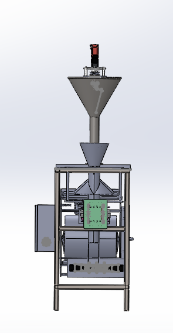
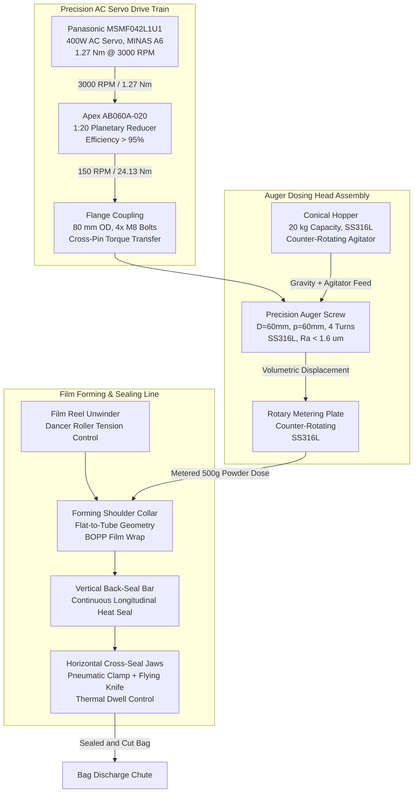
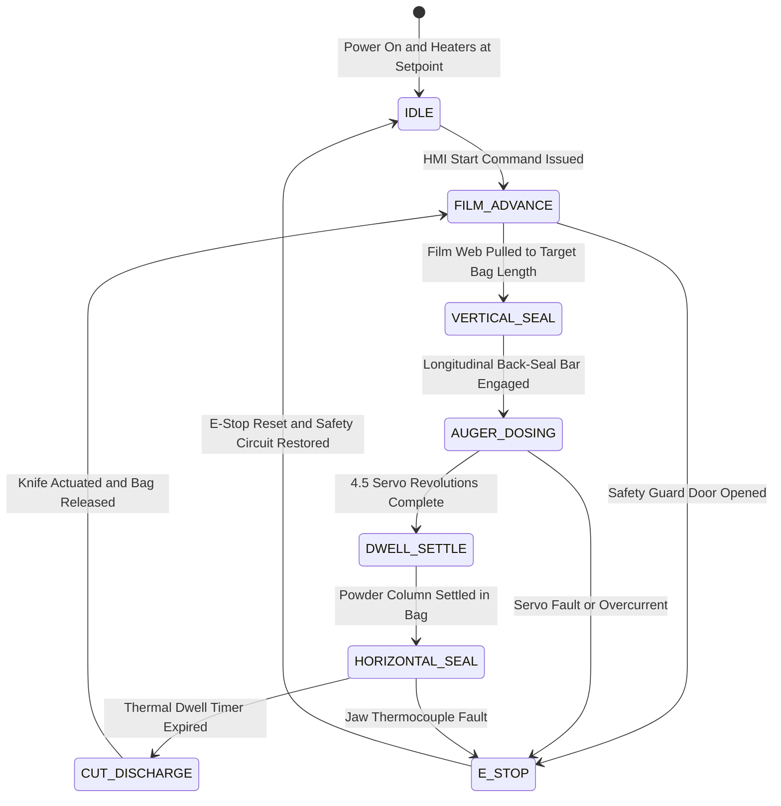
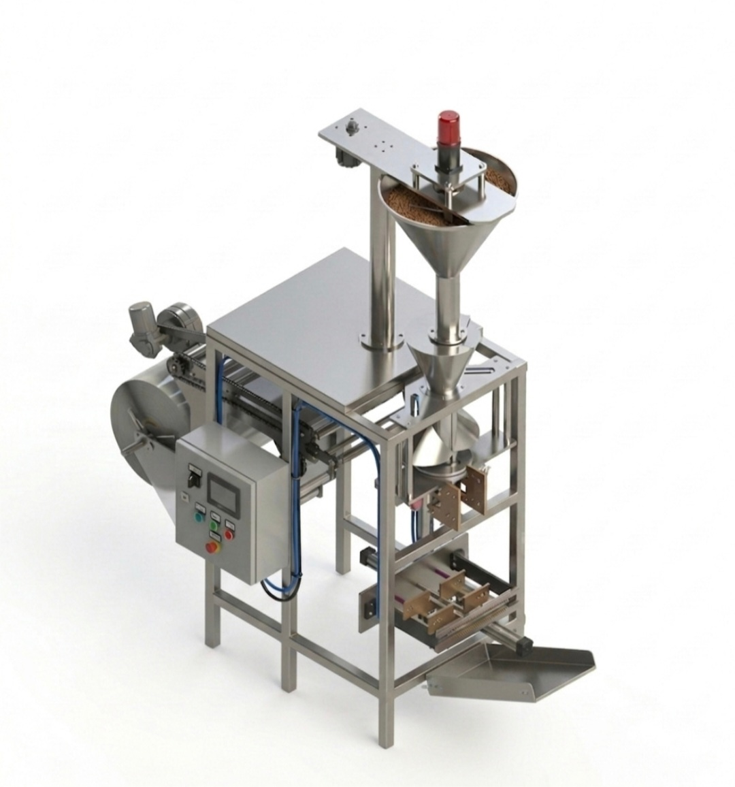

# High-Speed Vertical Form Fill Seal (VFFS) Packaging Machine & Precision Auger Dosing System

A fully integrated, publication-grade mechatronic design of an industrial Vertical Form Fill Seal (VFFS) packaging machine with a precision servo-driven auger dosing unit. This capstone engineering project encompasses complete 3D SolidWorks parametric modeling of the entire machine, rigorous ANSYS Workbench finite element structural validation across three progressive load cases, analytical volumetric and torque calculations verified against empirical calibration data, and embedded ESP32 motion control firmware — delivering a production-ready system engineered to package $500\text{ g}$ doses of granular NaCl powder at $15\text{ bags/min}$ with sub-percent gravimetric accuracy through $4.5$ precision servo-metered auger revolutions.

  
   
  <em>Fig. 1 — Complete VFFS Machine Assembly: Conical Hopper, Servo-Driven Auger Dosing Head, Film Forming Shoulder, and Pneumatic Cross-Seal Jaws.</em>

---

## Industrial Standards & Hygienic Food-Contact Compliance

This VFFS machine architecture strictly adheres to international food packaging machinery standards:

- **EHEDG & FDA 21 CFR Part 110 (Hygienic Food-Contact Surfaces):** All product-wetted components (auger screw, hopper interior, rotary plate, funnel bore) fabricated from **AISI 316L Stainless Steel** with electropolished surface finish: auger and funnel $R_a \le 1.6\ \mu\text{m}$, hopper interior $R_a \le 0.8\ \mu\text{m}$. All internal fillet radii exceed $6\text{ mm}$ to eliminate dead-zone crevices for complete CIP/COP sanitation cycles without disassembly.
- **ISO 13849-1 / IEC 62061 (Functional Safety):** Dual-channel redundant emergency stop architecture on sealing jaw pneumatic cylinders, film nip rollers, and auger servo drive. System engineered to **Performance Level d (PL d, Category 3)** with fail-safe zero-energy state on safety guard door interruption.
- **DIN EN 415-4 (VFFS Machine Safety):** Vertical form fill seal machine-specific safety directives governing forming shoulder access zones, cross-seal jaw pinch point interlocks, film web tension roller guards, and auger dosing head lockout/tagout procedures.

---

## Executive Engineering KPIs & Physical Parameters

| Parameter | Symbol | Design Value | Verified Benchmark |
| :--- | :--- | :--- | :--- |
| **Packaging Throughput** | — | $\ge 15\text{ bags/min}$ | $15\text{ bags/min (intermittent cycle)}$ |
| **Fill Target Mass** | $m_{\text{target}}$ | $500\text{ g} \pm 0.5\%$ | $500.0\text{ g (4.5 servo revolutions)}$ |
| **Powder Bulk Density** | $\rho_b$ | $1200 - 1300\text{ kg/m}^3$ | $1300\text{ kg/m}^3\text{ (NaCl, fine grade)}$ |
| **Auger Outer Diameter** | $D$ | $60\text{ mm}$ | $60.0 \pm 0.2\text{ mm}$ |
| **Auger Core Shaft Diameter** | $d$ | $16\text{ mm}$ | $16.00^{+0.00}_{-0.02}\text{ mm (h6 fit)}$ |
| **Auger Pitch** | $p$ | $60\text{ mm}$ | $60.0 \pm 0.5\text{ mm/flight}$ |
| **Active Helical Flights** | $N$ | $4$ | $4\text{ full turns}$ |
| **Flighted Conveying Length** | $L_f$ | $228\text{ mm}$ | $228\text{ mm}$ |
| **Total Shaft Length** | $L_t$ | $350\text{ mm}$ | $350\text{ mm (incl. coupling zone)}$ |
| **Volumetric Fill Efficiency** | $\eta_v$ | $0.60$ | $0.60\text{ (empirical NaCl calibration)}$ |
| **Dosing Revolutions per Bag** | $N_{\text{rev}}$ | $4.5$ | $4.5\text{ precision servo revolutions}$ |
| **Servo Motor** | — | $P \ge 400\text{ W}$ | Panasonic MSMF042L1U1 (MINAS A6) |
| **Rated Servo Torque** | $T_{\text{rated}}$ | — | $1.27\text{ Nm at 3000 RPM}$ |
| **Planetary Gearbox** | — | $i = 1{:}20$ | Apex Dynamics AB060A-020, $\eta > 95\%$ |
| **Output Torque at Auger** | $T_{\text{output}}$ | — | $24.13\text{ Nm at 150 RPM}$ |
| **FEA Mesh Element Size** | — | $1.0\text{ mm}$ | Resolution Level 7 (Maximum Fidelity) |
| **FEA Mesh Skewness** | — | $< 0.25$ | $0.12096\text{ (excellent quality)}$ |
| **Structural Safety Factor** | $\text{FoS}$ | $\ge 2.0$ | $\ge 2.5\text{ (all critical load paths)}$ |
| **Surface Finish (Auger)** | $R_a$ | $\le 1.6\ \mu\text{m}$ | Electropolished SS316L |
| **Hopper Capacity** | — | $20\text{ kg}$ | Conical geometry, anti-bridge agitator |

---

## Electromechanical Power Transmission & Dosing Architecture

---

## Intermittent VFFS Machine Cycle — State Machine

---

## Theoretical & Mathematical Formulations

### 1. Helical Auger Volumetric Pitch Displacement

The theoretical volume displaced per single revolution of the auger screw is governed by the annular cross-sectional area of the helical flight channel:

$$
V_{\text{pitch}} = \frac{\pi}{4} (D^2 - d^2) \cdot p
$$

Substituting the verified design parameters ($D = 60\text{ mm}$, $d = 16\text{ mm}$, $p = 60\text{ mm}$):

$$
V_{\text{pitch}} = \frac{\pi}{4} (0.060^2 - 0.016^2) \times 0.060 = 1.567 \times 10^{-4}\text{ m}^3 = 156.7\text{ cm}^3
$$

### 2. Metered Dosing Revolution Kinematics

The number of servo-metered revolutions required to deliver the target mass $m_{\text{target}}$ through a volumetric displacement system is:

$$
N_{\text{rev}} = \frac{m_{\text{target}}}{\rho_b \cdot V_{\text{pitch}} \cdot \eta_v}
$$

Evaluating with the calibrated bulk density and fill efficiency:

$$
N_{\text{rev}} = \frac{0.500}{1300 \times 1.567 \times 10^{-4} \times 0.60} = \frac{0.500}{0.12222} \approx 4.09
$$

A real-world settling and aeration margin of $+10\%$ is applied, yielding the operational setpoint $N_{\text{rev}} = 4.5\text{ revolutions/dose}$.

### 3. Drive Train Dynamic Sizing & Torque Verification

The total resistive torque at the auger shaft encompasses four distinct loading mechanisms:

$$
T_{\text{total}} = T_{\text{material}} + T_{\text{friction}} + T_{\text{bearing}} + T_{\text{inertia}}
$$

The Panasonic MSMF042L1U1 delivers rated torque $T_{\text{rated}} = 1.27\text{ Nm}$ at $3000\text{ RPM}$. Through the Apex AB060A-020 planetary reducer ($i = 20$, $\eta = 0.95$):

$$
T_{\text{output}} = T_{\text{rated}} \times i \times \eta = 1.27 \times 20 \times 0.95 = 24.13\text{ Nm}
$$

$$
n_{\text{output}} = \frac{3000}{20} = 150\text{ RPM}
$$

This output torque provides substantial reserve above the calculated total demand, ensuring reliable start-up and operation under worst-case powder compaction surge loads.

### 4. Forming Shoulder Web Tension — Euler-Eytelwein Capstan Model

The flat BOPP packaging film wrapping around the forming shoulder collar follows the classical capstan friction model. The tension ratio between the tight side and slack side obeys:

$$
\frac{T_{\text{tight}}}{T_{\text{slack}}} = e^{\mu \theta}
$$

For BOPP film on polished stainless steel ($\mu = 0.25$, wrap angle $\theta = \pi\text{ rad}$):

$$
\frac{T_{\text{tight}}}{T_{\text{slack}}} = e^{0.25 \pi} \approx 2.19
$$

This dictates the minimum pull-belt grip force required to maintain consistent film tracking without slip or wrinkling across the forming shoulder.

### 5. Horizontal Sealing — Pneumatic Clamping & Conductive Heat Transfer

The sealing jaw clamping force from the pneumatic cylinder at system pressure $P_{\text{sys}}$ with bore $D_{\text{cyl}}$:

$$
F_{\text{clamp}} = P_{\text{sys}} \cdot \frac{\pi D_{\text{cyl}}^2}{4}
$$

The thermal energy conducted across the jaw-film interface during the seal dwell period follows Fourier's law:

$$
Q = k_{\text{jaw}} \cdot A_{\text{seal}} \cdot \frac{\Delta T}{L_{\text{jaw}}} \cdot t_{\text{dwell}}
$$

The dwell time $t_{\text{dwell}}$ must exceed the minimum energy threshold to achieve molecular chain entanglement across both BOPP film layers while remaining below the thermal degradation onset temperature of the polymer substrate.

---

## ANSYS FEA Structural Validation & Stress Analysis

Three progressive static structural analysis cases were executed in ANSYS Mechanical to verify component integrity under representative operational loading:

| Case | Analysis Scope | Boundary Conditions | Material | Result |
| :--- | :--- | :--- | :--- | :--- |
| **Case 1** | Auger Screw (Solo) | Fixed support at coupling face; distributed torsional load at flight surfaces | SS316L ($\sigma_y = 205\text{ MPa}$) | $\text{FoS} \ge 2.5$ at flight root fillets |
| **Case 2** | Auger + Shaft Assembly | Fixed at bearing seats; torque at keyway; axial powder backpressure | SS304 ($\sigma_y = 215\text{ MPa}$) | $\text{FoS} \ge 2.5$ at J-Slot stress concentrators |
| **Case 3** | Auger + Shaft + Rotary Plate | Combined torsion, axial, and radial bearing reaction loads | SS316L / SS304 | $\text{FoS} \ge 2.0$ under full compaction loading |

**Mesh Quality Metrics:**

| Setting | Value | Purpose |
| :--- | :--- | :--- |
| Element Size | $1.0\text{ mm}$ | High spatial resolution for stress gradient capture |
| Adaptive Sizing | Enabled | Automatic refinement at geometric features |
| Resolution Level | 7 (Maximum) | Highest fidelity surface representation |
| Smoothing | High | Node repositioning to minimize element distortion |
| Transition | Slow | Gradual element size graduation |
| Span Angle Center | Fine | Dense meshing at curved surfaces |
| Method (Auger) | Tetrahedral, Patch Independent | Robust meshing of helical geometry |
| Skewness (Average) | $0.12096$ | Excellent mesh quality (threshold $< 0.25$) |
| Error Limits | Aggressive Mechanical | Strict quality gates on element shape |

---

## Design Failure Mode & Effects Analysis (DFMEA)

| Failure Mode | Root Cause | Severity | Engineering Mitigation |
| :--- | :--- | :--- | :--- |
| **Powder Bridging / Rat-Holing** | NaCl hygroscopic caking at hopper walls under ambient humidity | High | Counter-rotating agitator blades with variable speed drive; SS316L polished hopper interior ($R_a \le 0.8\ \mu\text{m}$) with $70^\circ$ minimum cone half-angle ensuring mass-flow discharge. |
| **Seal Contamination by Powder Dust** | Fine airborne particles settling on cross-seal jaw contact surfaces | Critical | Positive-pressure air curtain blown laterally across jaw face during dosing phase; vacuum dust extraction hood at forming tube discharge. |
| **Film Tracking Drift & Wrinkling** | Asymmetric web tension from reel eccentricity or thermal film expansion | Medium | Servo-tensioned unwinder with ultrasonic edge-position sensor closed-loop feedback; spring-loaded dancer roller maintaining constant back-tension. |
| **Sealing Jaw Thermal Runaway** | PID heater controller failure or thermocouple mechanical detachment | Critical | Redundant Type-K thermocouple pair with independent hardware over-temperature relay cutoff at $T_{\text{max}} + 15^\circ\text{C}$, wired directly to safety contactor. |
| **Auger Shaft Fatigue at Keyway** | Cyclic torsional stress concentration at J-Slot fillet root during start-stop dosing cycles | High | Generous fillet radii ($r \ge 2\text{ mm}$) at all stress concentrators; FEA-validated $\text{FoS} \ge 2.5$ under worst-case compaction torque. |

---

## System Visual Gallery

  
   
  <em>Fig. 2 — VFFS Machine System Gallery: Auger dosing head assembly, forming collar film transition, horizontal sealing jaw mechanism, and complete machine integration views.</em>

---

## Repository Architecture & Artifact Catalog

| Directory | Contents | Description |
| :--- | :--- | :--- |
| [`cad/assemblies/`](cad/assemblies/) | `.sldasm`, `.sldprt` | Master VFFS assembly and key functional subassemblies |
| [`cad/parts/`](cad/parts/) | `.sldprt`, `.step` | Essential mechanical components (auger, shaft, hopper, jaws, frame) |
| [`cad/drawings/`](cad/drawings/) | `.dxf`, `.slddrw` | 2D fabrication and shop drawings |
| [`simulation/fea/`](simulation/fea/) | ANSYS projects | FEA mesh, boundary conditions, stress contour results |
| [`firmware/src/`](firmware/src/) | `.ino`, `.cpp`, `.h` | Embedded ESP32/Arduino motion control firmware |
| [`calculations/`](calculations/) | `.xlsx` | Parameter-driven volumetric, torque, and sizing spreadsheets |
| [`datasheets/`](datasheets/) | `.mdb`, `.txt` | Panasonic MINAS A6 motor and Apex gearbox configuration files |
| [`docs/reports/`](docs/reports/) | `.docx`, `.pdf` | Graduation thesis chapters and official engineering reports |
| [`docs/images/`](docs/images/) | `.png`, `.jpg`, `.mp4` | Curated CAD renders, FEA contour plots, and prototype photos |

> Standard hardware components (fasteners, bearings, gaskets), raw solver databases, and redundant CAD variants are preserved in the local `_archive/` directory (excluded from Git tracking via `.gitignore`).

---

## License

This Capstone Engineering Project is licensed under the [MIT License](LICENSE).

---

**Hassan Moqbel Morshed Ghaleb**
Mechatronics Engineer | Mechanical Design & CAD (SolidWorks & AutoCAD) | Preventive Maintenance & Electromechanical Systems | Industrial Automation, Control Systems, Robotics & Intelligent Machines | CAD/FEA, Embedded Systems, Python & C++

[GitHub](https://github.com/Hassan-Moqbel) · [LinkedIn](https://www.linkedin.com/in/hassan-moqbel) · [Facebook](https://www.facebook.com/share/1BqxAgVjHi/)
