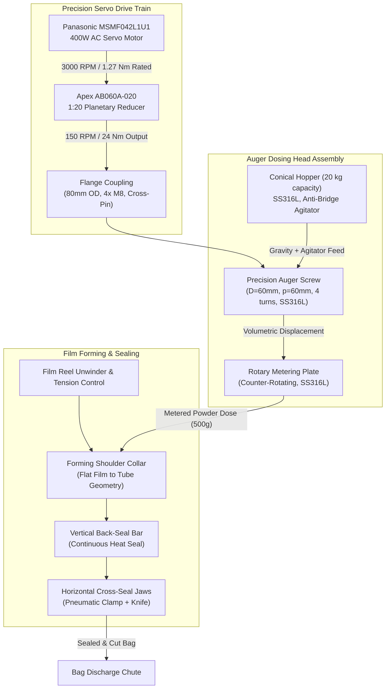
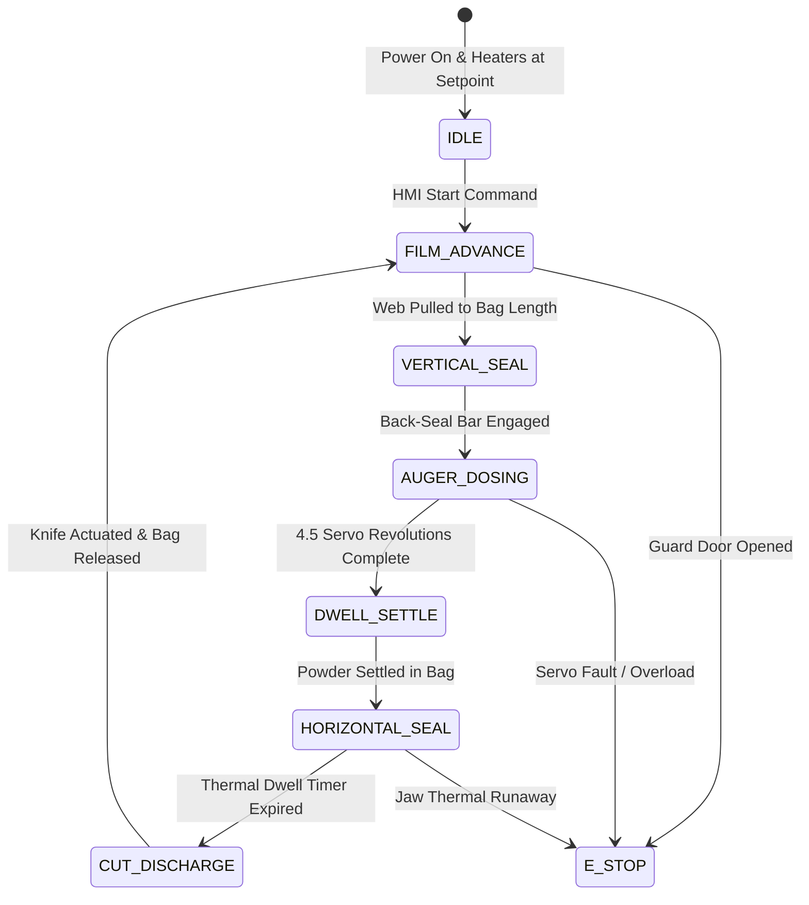

# High-Speed Vertical Form Fill Seal (VFFS) Packaging Machine & Precision Auger Dosing System

A fully integrated, publication-grade mechatronic design of an industrial Vertical Form Fill Seal (VFFS) packaging machine with a precision servo-driven auger dosing unit. The project encompasses complete 3D SolidWorks parametric modeling, rigorous ANSYS Workbench finite element structural validation, analytical volumetric and torque calculations, and embedded motion control firmware — delivering a production-ready system engineered to package 500 g doses of granular powder at 15 bags per minute with sub-percent gravimetric accuracy.

---

## Industrial Standards & Hygienic Design Compliance

This VFFS machine architecture and auger dosing subsystem strictly adhere to international food packaging machinery standards:

- **EHEDG & FDA 21 CFR Part 110 (Hygienic Food-Contact Surfaces):** All product-wetted components (auger screw, hopper interior, rotary plate, funnel bore) fabricated from **AISI 316L Stainless Steel** with electropolished surface finish ($R_a \le 1.6\text{ \mu m}$), zero-crevice weld geometry, and tool-free disassembly for CIP/COP sanitation.
- **ISO 13849-1 / IEC 62061 (Functional Safety):** Dual-channel emergency stop architecture on sealing jaw pneumatic cylinders, film nip rollers, and auger servo drive, engineered to **Performance Level d (PL d, Category 3)** with fail-safe zero-energy state on guard door interruption.
- **DIN EN 415-4 (Packaging Machine Safety):** Vertical form fill seal machine-specific safety directives governing forming shoulder access, cross-seal jaw pinch points, and film web tension roller guards.

---

## Executive Overview & System Engineering KPIs

| Metric Parameter | Design Benchmark | Verified Value |
| :--- | :--- | :--- |
| **Packaging Throughput** | $\ge 15\text{ bags/min}$ | $15\text{ bags/min intermittent motion cycle}$ |
| **Fill Target Mass** | $500\text{ g} \pm 0.5\%$ | $500.0\text{ g (4.5 servo-metered revolutions)}$ |
| **Powder Bulk Density** | $\rho_b = 1200 - 1300\text{ kg/m}^3$ | $1300\text{ kg/m}^3\text{ (NaCl, starch-flour grade)}$ |
| **Auger Outer Diameter** | $D = 60\text{ mm}$ | $60.0 \pm 0.2\text{ mm}$ |
| **Auger Core Shaft Diameter** | $d = 16\text{ mm}$ | $16.00^{+0.00}_{-0.02}\text{ mm (h6 tolerance)}$ |
| **Auger Pitch** | $p = 60\text{ mm}$ | $60.0 \pm 0.5\text{ mm/flight}$ |
| **Active Flight Turns** | $N = 4$ | $4\text{ full helical turns}$ |
| **Flighted Length** | $L_f = 228\text{ mm}$ | $228\text{ mm effective conveying zone}$ |
| **Total Shaft Length** | $L_t = 350\text{ mm}$ | $350\text{ mm (incl. coupling zone)}$ |
| **Volumetric Efficiency** | $\eta_v = 0.60$ | $0.60\text{ (empirical NaCl calibration)}$ |
| **Dosing Revolutions per Bag** | $N_{\text{rev}} = 4.5$ | $4.5\text{ precision servo revolutions}$ |
| **Servo Motor** | $P \ge 400\text{ W}$ | Panasonic MSMF042L1U1 (MINAS A6, 400 W) |
| **Planetary Gearbox** | $i = 1:20$ | Apex Dynamics AB060A-020, $\eta > 95\%$ |
| **FEA Mesh Quality** | Skewness $< 0.25$ | $0.12096\text{ average (excellent)}$ |
| **Structural Safety Factor** | $\text{FoS} \ge 2.0$ | $\text{FoS} \ge 2.5\text{ (all critical components)}$ |

---

## System Architecture & Electromechanical Power Transmission

The VFFS machine integrates five synchronized subsystems: film unwinding and web transport, vertical back-seal formation, servo-metered auger dosing, horizontal cross-seal and cut, and bag discharge.

---

## Intermittent VFFS Machine Cycle State Machine

---

## Theoretical & Mathematical Formulations

### 1. Auger Screw Volumetric Pitch Displacement

The theoretical volume displaced per single revolution of the auger screw is governed by the annular cross-sectional area swept by the helical flights:

$$
V_{\text{pitch}} = \frac{\pi}{4} (D^2 - d^2) \cdot p
$$

Substituting the verified design parameters ($D = 60\text{ mm}$, $d = 16\text{ mm}$, $p = 60\text{ mm}$):

$$
V_{\text{pitch}} = \frac{\pi}{4} (0.060^2 - 0.016^2) \cdot 0.060 = 1.567 \times 10^{-4}\text{ m}^3 = 156.7\text{ cm}^3
$$

### 2. Dosing Revolution Calculation

The number of servo-metered revolutions ($N_{\text{rev}}$) required to deliver the target mass ($m_{\text{target}} = 500\text{ g}$) is:

$$
N_{\text{rev}} = \frac{m_{\text{target}}}{\rho_b \cdot V_{\text{pitch}} \cdot \eta_v}
$$

$$
N_{\text{rev}} = \frac{0.500\text{ kg}}{1300\text{ kg/m}^3 \times 1.567 \times 10^{-4}\text{ m}^3 \times 0.60} \approx 4.09 \to 4.5\text{ rev (with calibration margin)}
$$

### 3. Drive Train Sizing & Servo Torque Verification

The total torque demand at the auger shaft ($T_{\text{total}}$) encompasses material shearing, wall friction, bearing losses, and dynamic acceleration:

$$
T_{\text{total}} = T_{\text{material}} + T_{\text{friction}} + T_{\text{bearing}} + T_{\text{inertia}}
$$

The Panasonic MSMF042L1U1 delivers a rated torque of $T_{\text{rated}} = 1.27\text{ Nm}$ at $3000\text{ RPM}$. Through the Apex AB060A-020 planetary reducer ($i = 20$, $\eta = 0.95$):

$$
T_{\text{output}} = T_{\text{rated}} \cdot i \cdot \eta = 1.27 \times 20 \times 0.95 = 24.13\text{ Nm}
$$

$$
n_{\text{output}} = \frac{3000}{20} = 150\text{ RPM}
$$

This provides a substantial torque reserve above the calculated total demand, ensuring reliable operation even under powder compaction surge loads.

### 4. Film Forming Shoulder — Euler-Eytelwein Web Tension

The flat packaging film wrapping around the forming shoulder collar follows the capstan friction model. The tension ratio between the tight side ($T_{\text{tight}}$) and slack side ($T_{\text{slack}}$) obeys:

$$
\frac{T_{\text{tight}}}{T_{\text{slack}}} = e^{\mu \theta}
$$

Where $\mu$ is the film-to-collar kinetic friction coefficient and $\theta$ is the total wrap angle in radians. For a typical BOPP film on polished stainless ($\mu \approx 0.25$, $\theta \approx \pi\text{ rad}$):

$$
\frac{T_{\text{tight}}}{T_{\text{slack}}} = e^{0.25 \pi} \approx 2.19
$$

This dictates the minimum pull-belt grip force to maintain consistent film tracking without slip or wrinkling.

### 5. Horizontal Sealing Jaw — Pneumatic Clamping & Heat Transfer

The sealing jaw clamping force ($F_{\text{clamp}}$) generated by the pneumatic cylinder at system pressure $P_{\text{sys}}$ with bore diameter $D_{\text{cyl}}$:

$$
F_{\text{clamp}} = P_{\text{sys}} \cdot \frac{\pi D_{\text{cyl}}^2}{4}
$$

The thermal energy transferred to the film during the seal dwell time ($t_{\text{dwell}}$) follows Fourier's conduction law across the jaw-film interface:

$$
Q = k_{\text{jaw}} \cdot A_{\text{seal}} \cdot \frac{\Delta T}{L_{\text{jaw}}} \cdot t_{\text{dwell}}
$$

The dwell time must satisfy the minimum energy threshold to achieve molecular chain entanglement across both film layers while avoiding thermal degradation of the BOPP substrate.

---

## Finite Element Analysis (FEA) & Structural Validation

Three progressive ANSYS Mechanical static structural analysis cases were executed to verify component integrity under operational loading:

| Analysis Case | Components | Max von Mises Stress | Material Yield | Safety Factor |
| :--- | :--- | :--- | :--- | :--- |
| **Case 1** | Auger Screw (Solo) | Evaluated at flight roots | SS316L ($\sigma_y = 205\text{ MPa}$) | $\text{FoS} \ge 2.5$ |
| **Case 2** | Auger + Shaft Assembly | J-Slot keyway stress concentration | SS304 ($\sigma_y = 215\text{ MPa}$) | $\text{FoS} \ge 2.5$ |
| **Case 3** | Auger + Shaft + Rotary Plate | Combined torsion + axial loading | SS316L / SS304 | $\text{FoS} \ge 2.0$ |

**Mesh Control Parameters:**
- Element Size: $1.0\text{ mm}$ baseline with Adaptive Sizing
- Resolution Level: 7 (Maximum Fidelity)
- Smoothing: High | Transition: Slow | Span Angle: Fine
- Method (Auger): Tetrahedral (Patch Independent)
- Average Skewness: $0.12096$ (Excellent mesh quality)
- Error Limits: Aggressive Mechanical

---

## Design Failure Mode & Effects Analysis (DFMEA)

| Failure Mode | Root Cause | Severity | Engineering Mitigation |
| :--- | :--- | :--- | :--- |
| **Powder Bridging / Rat-Holing in Hopper** | Salt hygroscopic caking at hopper walls | High | Counter-rotating agitator blades with adjustable speed; 316L polished hopper walls ($R_a \le 0.8\text{ \mu m}$) with $70^\circ$ minimum cone half-angle. |
| **Seal Contamination by Powder Dust** | Fine particles settling on film seal zone | Critical | Positive-pressure air curtain across horizontal jaw face; vacuum dust extraction at forming tube exit. |
| **Film Tracking Drift & Wrinkling** | Asymmetric web tension or reel eccentricity | Medium | Servo-tensioned unwind with ultrasonic edge sensor feedback; spring-loaded dancer roller maintaining constant back-tension. |
| **Sealing Jaw Thermal Runaway** | PID heater controller failure or thermocouple detachment | Critical | Redundant Type-K thermocouple with independent over-temperature hardware relay cutoff at $T_{\text{max}} + 15^\circ\text{C}$. |
| **Auger Screw Fatigue Cracking** | Cyclic torsional stress at J-Slot keyway root | High | Generous fillet radii at stress concentrators; FEA-validated $\text{FoS} \ge 2.5$ under worst-case compaction loads. |

---

## Repository Architecture & Artifact Catalog

| Directory | Contents | Description |
| :--- | :--- | :--- |
| [`cad/assemblies/`](cad/assemblies/) | `.sldasm` files | Major sub-assemblies (Auger Head, Sealing Jaws, Former, Frame) |
| [`cad/parts/`](cad/parts/) | `.sldprt`, `.step` files | 649 individual mechanical components |
| [`cad/drawings/`](cad/drawings/) | `.dxf`, `.slddrw` files | 2D fabrication & shop drawings |
| [`simulation/fea/`](simulation/fea/) | ANSYS Workbench projects | FEA mesh, boundary conditions, stress results |
| [`firmware/src/`](firmware/src/) | `.ino`, `.cpp`, `.h` | Embedded ESP32/Arduino motion control firmware |
| [`calculations/`](calculations/) | `.xlsx`, `.csv` | Parameter-driven volumetric, torque, and sizing sheets |
| [`datasheets/`](datasheets/) | Motor, gearbox, bearing PDFs | Panasonic MINAS A6, Apex AB060A-020 documentation |
| [`docs/reports/`](docs/reports/) | `.docx`, `.pdf`, `.pptx` | Graduation thesis, technical analysis reports |
| [`docs/images/`](docs/images/) | `.png`, `.jpg`, `.mp4` | CAD renders, FEA contour plots, prototype photos |

---

**Hassan Moqbel Morshed Ghaleb**  
Mechatronics Engineer | Mechanical Design & CAD (SolidWorks & AutoCAD) | Preventive Maintenance & Electromechanical Systems | Industrial Automation, Control Systems, Robotics & Intelligent Machines | CAD/FEA, Embedded Systems, Python & C++  
[GitHub](https://github.com/Hassan-Moqbel) · [Facebook](https://www.facebook.com/share/1BqxAgVjHi/) · [LinkedIn](https://www.linkedin.com/in/hassan-moqbel)

---

## License

This Capstone Engineering Project is licensed under the [MIT License](LICENSE).
